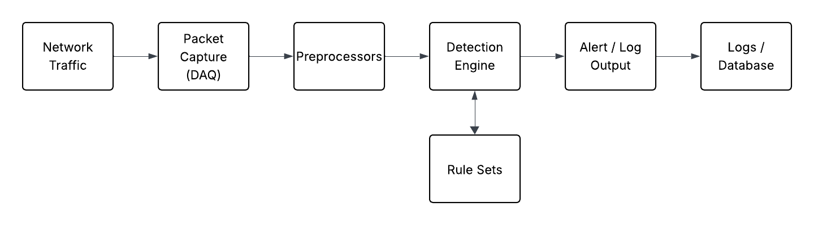

# Snort IDS Analysis

This repository contains a research and lab exploration of **Snort**, an open-source Network Intrusion Detection and Prevention System (IDS/IPS).

The project examines how intrusion detection systems analyze network traffic, apply rule sets, and generate alerts when suspicious activity is detected.

---

## Overview

Intrusion Detection Systems (IDS) play a critical role in modern network security infrastructure. This project explores how **Snort functions as a Network Intrusion Detection System (NIDS)** and demonstrates how custom detection rules can be used to identify suspicious network activity.

The project includes:

* A research paper explaining IDS concepts and Snort architecture
* A readable project summary
* Custom Snort detection rules
* A virtual lab used to test IDS alerts

---

## Project Structure

```
snort-ids-analysis
│
├── README.md
├── summary.md
├── lab-setup.md
│
├── paper
│   └── snort-ids-analysis.pdf
│
├── snort-rules
│   ├── syn-port-scan.rules
│   └── suspicious-payload.rules
│
└── images
    └── snort-architecture.png
```

---

## Snort Architecture



Snort captures network traffic, preprocesses packets for normalization, evaluates them against rule sets in the detection engine, and generates alerts when suspicious activity is detected.

---

## Contents

📄 **Research Paper**

* [Full Research Paper](paper/snort-ids-analysis.pdf)

📖 **Project Summary**

* [Readable Summary](summary.md)

🧪 **Lab Setup**

* [Snort Testing Environment](lab-setup.md)

---

## Example Snort Rule

Detect potential TCP SYN port scanning activity:

```snort
alert tcp any any -> $HOME_NET any
(
flags: S;
msg:"TCP SYN Flag Detected!";
sid:1000000;
rev:1;
)
```

This rule generates an alert when TCP packets with the **SYN flag** are detected targeting the monitored network, which can indicate port scanning activity.

---

## Tools Used

* Snort
* Kali Linux
* Nmap
* Virtual Machine networking

---

## Future Improvements

* Implement additional Snort detection rules
* Test anomaly detection approaches
* Analyze real network traffic datasets
* Compare Snort with Suricata

---

## References

* Cisco Talos. *Snort 3 Rule Writing Guide*
  https://docs.snort.org

* Scarfone, K., & Mell, P. *Guide to Intrusion Detection and Prevention Systems (NIST SP 800-94)*
  https://nvlpubs.nist.gov/nistpubs/Legacy/SP/nistspecialpublication800-94.pdf

* IBM Security. *What is an Intrusion Detection System (IDS)?*
  https://www.ibm.com/think/topics/intrusion-detection-system
